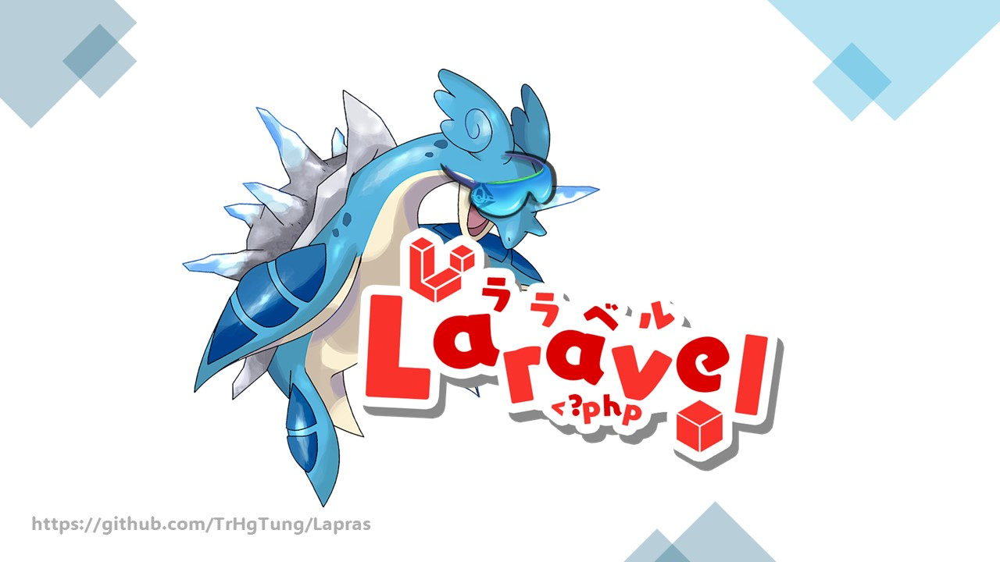

<h1>Lapras - Một hệ thống vận hành nhà xe cơ bản</h1>
<h2>GIỚI THIỆU</h2>

Video: https://youtu.be/0WWv82OsUTw

<h6>Phiên bản: 1.0</h6>

Một hệ thống vận hành theo nghiệp vụ <i>Xe khách dịch vụ</i> 

    - Các chủ thể: Khách hàng & Nhà xe
    - Kiến trúc phần mềm: Layered Architecture - Server-Side Rendering - Laravel (MVC)

<h2>CÁC CÔNG NGHỆ NỔI BẬT</h2>
1. <b> Laravel </b>:  
- Tài liệu: https://laravel.com/  
- Tham khảo: ChatGPT (https://chat.openai.com/), StackOverFlow (https://stackoverflow.com/), Laracasts (https://laracasts.com/)   
2. <b> Xuất Excel (PhpSpreadsheet)</b>:  
- Tài liệu: https://phpspreadsheet.readthedocs.io/en/latest/  
- Tham khảo: https://youtu.be/F3uPQyc08jA   
3. <b> Hiển thị biểu đồ (ChartJS)</b>:  
- Tài liệu: https://www.chartjs.org/  
- Tham khảo: https://www.chartjs.org/docs/latest/getting-started/integration.html   
4. <b> SMTP - Hệ thống gửi e-mail (PHPMailer)</b>:  
- <i>Bạn có thể sử dụng MailPit (có sẵn trong Laravel) để thiết lập hệ thống SMTP</i> 
- Tài liệu: https://github.com/PHPMailer/PHPMailer  
- Tham khảo: https://github.com/PHPMailer/PHPMailer   

<h2>CÁC TÍNH NĂNG NỔI BẬT</h2>
<h4>Phía Khách hàng:</h4>
1. Đăng nhập, đăng ký, đăng xuất (Sử dụng Session để lưu phiên đăng nhập người dùng) 
2. Khôi phục mật khẩu  
3. Đặt xe trước (tương tự tính năng Giỏ hàng trên các Website thương mại điện tử) 
4. Thanh toán nhập thông tin thẻ (Giả chức năng - do chưa tích hợp cổng thanh toán bên thứ 3 (như MoMo, VNPay, ...)) 
5. Gửi e-mail phản hồi (sử dụng PHPMailer) 
6. Mini-game  
Ngoài ra còn có hiển thị thông tin các tuyến xe, tìm kiếm tuyến theo thời gian, ...
<h4>Phía Nhà xe (Phân quyền quản trị):</h4>
1. Đăng nhập, đăng xuất (Sử dụng Session để lưu phiên đăng nhập người dùng) 
2. Phân loại Người quản trị (Admin thường và Admin Master, với tài khoản Admin Master sẽ có nhiều quyền hơn)  
3. Xem và quản lý các nghiệp vụ của một nhà xe 
4. Xem dữ liệu doanh thu (sử dụng ChartJS) và xuất dữ liệu doanh thu (sử dụng PhpSpreadsheet) 

<h2>YÊU CẦU TRƯỚC KHI CÀI ĐẶT SOURCE</h2>

1. Trên máy tính (Test/Dev/Server) đã cài đặt XAMPP (có sẵn MySQL, PHP, Apache, ....)  

2. Kiểm tra PHP đã cài đặt chưa. Mở Command line: chạy lệnh `php --version` , yêu cầu phiên bản PHP phải lớn hơn 8.2  

    > Nếu chạy lệnh `php --version` trả về lỗi, hãy tự tìm cách để thiết lập biến môi trường Windows cho PHP (Gợi ý từ khóa: set environment variable for windows) 

3. Đã cài đặt Composer (https://getcomposer.org/download/). Composer khi cài đặt phải nhận phiên bản PHP đang có trên máy  
4. Các bạn hãy tự thiết lập lại các cấu hình để sử dụng SMTP với Google App Password (trong các Controllers: `FeedbackController`, `HomeController` và `UserRestorationController`).
    > Thiết lập App Password để gửi e-mail với <a href="https://myaccount.google.com/apppasswords">tài khoản Google của bạn</a> 

<h2>CÁCH CÀI ĐẶT SOURCE</h2>

0. Chạy XAMPP với quyền admin, khởi động 2 dịch vụ: Apache và MySQL  
1. Thực hiện `git clone` source về, trong hệ quản trị CSDL MySQL (PHPMyAdmin : truy cập bằng trình duyệt với địa chỉ: 127.0.0.1:80/phpmyadmin) -> tạo 1 CSDL mới, đặt tên gì cũng được (VD: webdatxe) 
2. Mở command line: cd <tên thư mục chứa source>, chạy lệnh `composer update` (nếu ko được thì `composer install`)  
3. Copy file .env.example thành 1 file mới, và đổi tên file mới này thành .env  
4. Mở file .env mới tạo, tìm tới dòng DB_DATABASE=project và thay thế 'project' thành tên cơ sở dữ liệu được tạo trong MySQL (webdatxe) 
5. Chạy lệnh `php artisan key:generate` để tạo khóa truy cập cho localhost (Laravel)  
6. Chạy lệnh `php artisan migrate` để ánh xạ từ model lên cơ sở dữ liệu MySQL. Nếu lỗi xảy ra, hãy migrate file `2024_05_10_060200_update_database.php` trong thư mục BackupDB vào MySQL.  
    > (Kiểm tra dữ liệu trong CSDL) - Nếu sử dụng cách thức migrate vào CSDL, hãy vào MySQL để thêm một vài dữ liệu test. - Còn nếu import file backup thì không cần  
7. Chạy lệnh `php artisan serve --port 4401`. Lúc này ứng dụng sẽ chạy trên 127.0.0.1:4401, mở trình duyệt và truy cập bằng địa chỉ này  

<h2>CÁCH CHẠY SOURCE</h2>
1. Chạy Xampp với quyền admin, khởi động 2 dịch vụ: Apache và MySQL  
2. Chạy lệnh `php artisan serve --port 4401`. Lúc này ứng dụng sẽ chạy trên 127.0.0.1:4401, mở trình duyệt và truy cập bằng địa chỉ này  

> 127.0.0.1 chính là địa chỉ localhost 

<h3>LIÊN HỆ VÀ DONATE</h3>

Các bạn nếu thích dự án này, mong muốn có thêm tính năng mới (mở rộng dự án) hoặc chỉ đơn giản là muốn donate cho tôi ☕☕☕; hãy liên hệ với tôi qua Telegram: <i>@trhgtung</i> hoặc comment tại video bất kỳ với nội dung bạn mong muốn trên kênh Youtube: <a href="https://www.youtube.com/@TungSupport">@TungSupport</a>

Xin cảm ơn! 😍😍😍

<h3>NẾU CÓ LỖI XẢY RA / MUỐN ĐÓNG GÓP</h3>

- Các bạn muốn báo cáo lỗi: Hãy vào phần `Issues`

- Các bạn muốn đóng góp thêm tính năng: Hãy vào phần `Pull requests`

- Các bạn muốn báo cáo lỗi và tự sửa lỗi đó luôn: Thì làm như 2 mục trên 😆😆😆 và các bạn quá tuyệt vời 😎😎😎

> <i>Tại sao dự án có tên là Lapras</i>?   
>
> ... Đây là tên của một loài Pokémon có các đặc tính cũng như chiêu thức thích hợp với việc chở người / vận chuyển (Lapras Express)  

> <small><i>Đây là dự án đầu tiên của tôi áp dụng việc lấy tên của các Pokémon làm tên dự án</i></small>.
